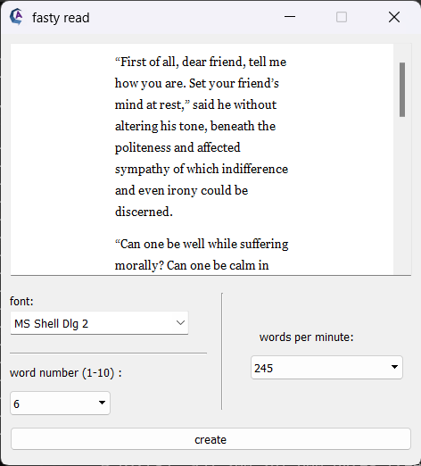

# fasty-read

Reading speed acceleration application with GUI. It simply takes a large text (maybe even a book) as input, and shows a specific number of words in selected time period. It is designed to get faster in reading while being able to read larger set of words at once. It is created to provide a free and open source alternative of the paid versions.

* Hundreds of fonts option
* Unlimited text capacity
* Free to use

    

    

