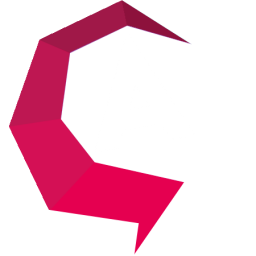

    

# Projects

Personal projects by Atahan Çaldır. Most of them are developed in middle school & high school years (2014-2018).

> *They exist only to have fun.*

Due to the large number of projects, they are categorized into dedicated folders.

### Outline

The folder structure and short explanations of the projects. Some projects might have their own readme files in their folders.

###### Desktop Applications

* Atalib [I](/Desktop%20Applications/Atalib%20I/)-[II](/Desktop%20Applications/Atalib%20II/)-[III](/Desktop%20Applications/Atalib%20III/)-[IV](/Desktop%20Applications/Atalib%20IV%20(Platon)/): A personal desktop software series for keeping track of my book library and wishlists. 4 different versions of Atalib are developed every year from 2015 to 2018. Each version stands top of the previous version with modernized programming techniques.
* [Video Downloader](/Desktop%20Applications/Video%20Downloader/): Youtube-dl based mp3/mp4 video downloader with GUI. It is compatible with Youtube, Dailymotion, Facebook, and much more.
* [Currency Viewer](/Desktop%20Applications/Currency%20Viewer/): Current exchange rates viewer with GUI.
* [fasty-read](/Desktop%20Applications/fasty-read/): Reading speed acceleration application with GUI. It simply takes a large text (maybe even a book) as input, and shows a specific number of words in selected time period. It is designed to get faster in reading while being able to read larger set of words at once.
* [Learning Management System](/Desktop%20Applications/Learning%20Management%20System/): Java learning management system application with GUI. It is developed for "CS 102 - Object Oriented Programming" course of Özyeğin University.
* [Socket Chat with GUI](/Desktop%20Applications/Socket%20Chat%20with%20GUI/): Socket chat software with GUI. It works in local network, but "Hamachi" software can be used to chat with external networks' computers.
* [Speechy](/Desktop%20Applications/Speechy/): Simple voice assistant that makes desktop tasks.
* [Tkinter Ebob Ekok](/Desktop%20Applications/Tkinter%20Ebob%20Ekok/): Greatest common factor (GCF) & least common multiple (LCM) calculator with a Tkinter GUI.

###### Games

* [Atamobil](/Games/Atamobil/): Pygame made automobile game.
* [Mine Sweeper](/Games/Mine%20Sweeper/): Java based mine sweeper game.

###### Hackathons

* [AlternatifBank Hackathon - Alternative POS Machine](/Hackathons/AlternatifBankHackathon%20-%20Alternative%20POS%20Machine/): An alternative POS machine software for blind people that double checks the contactless pay amount with voice assistant. The project won the 1st prize in Alternatif Bank's Unobstructed Banking Hackathon in 2020.
* [CodeMamak Hackathon - Sina](/Hackathons/CodeMamak%20Hackathon%20-%20Sina/): Customer recording software with GUI that enables the public places to report to ministry of health in case of a pandemic such as COVID-19. It has two separate versions; first version is for public places to take records, and the second version for the ministry to manage the records.
* [CodeMaster Hackathon](/Hackathons/CodeMasterHackathon/): RESTful API with Python for a complex website.
* [Yandex Hackathon - Apollo Application](/Hackathons/Yandex%20Hackathon%20-%20Apollo%20Application/): A mobile application concept with GUI. It is basically the "Pokemon GO of music" where musicians and users can pin songs to specific places on map, or discover the musics their nearby. The project won the Honor Team award in Yandex's MusicHackOzyegin Hackathon in 2020.

###### Websites

Personal HTML websites.

* [HTML Website 1](/Websites/HTML%20Website%201/)
* [HTML Website 2](/Websites/HTML%20Website%202/)
* [HTML Website 3](/Websites/HTML%20Website%203/)

###### Others

* [Facebook Simulator](/Others/Facebook%20Simulator/): Simple Facebook account hack script with a childish simulation. Oh, of course only for fun!
* [Scorpion](/Others/Scorpion/): Simple product price scrapper for an e-commerce website.
